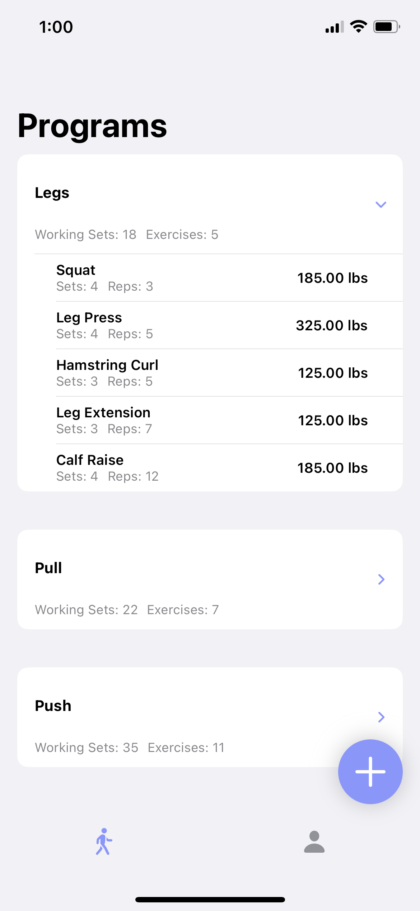
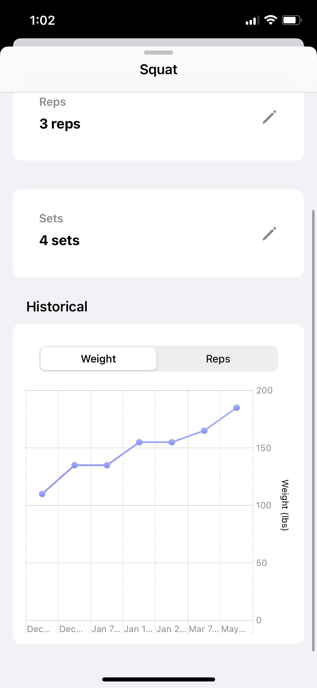
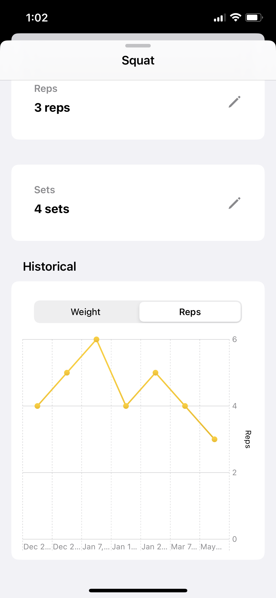
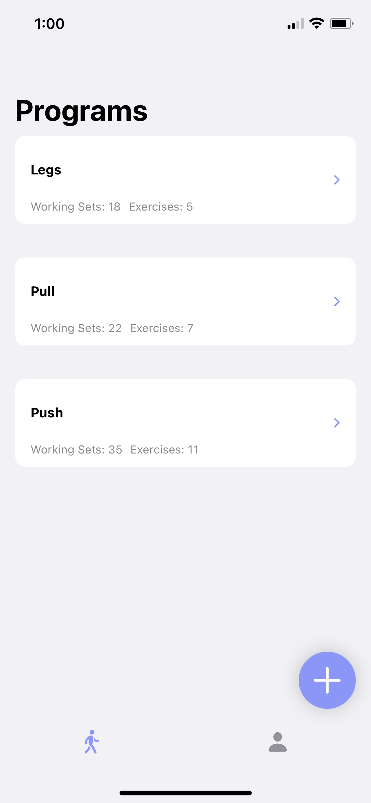
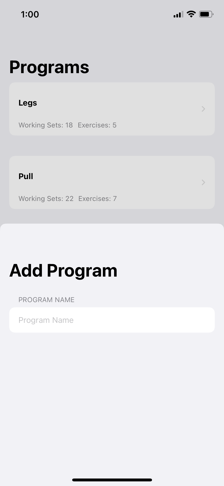
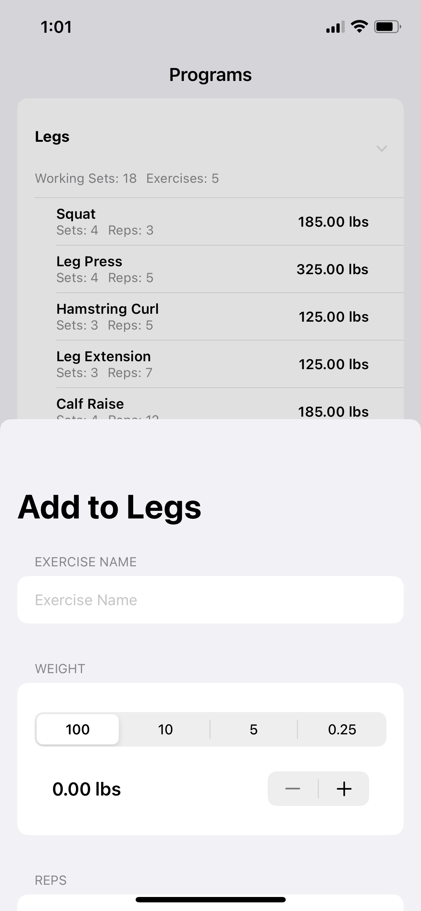
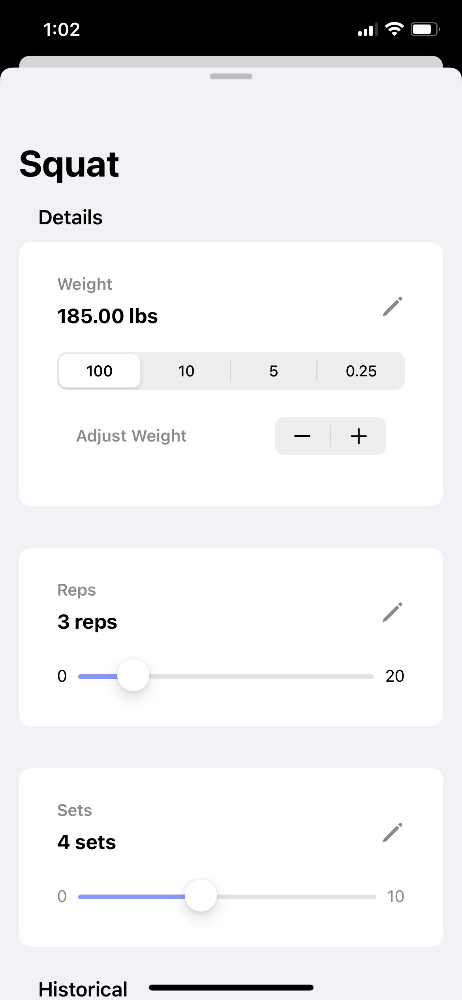

    <h1>Spotter</h1>
    
Simple iOS app to create workout routines and track progress. Made with SwiftUI and Core Data.

    
    
    

## Features
* Create your own workout programs, separated into groups
* View individual exercises easily at a glance
* Detailed exercise view with quick editing capabilities
* Visual chart showing weight & rep progression

## Screenshots

    
    
    
    

